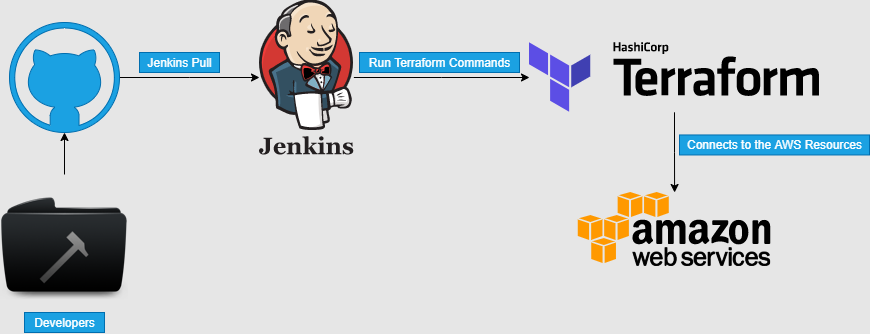
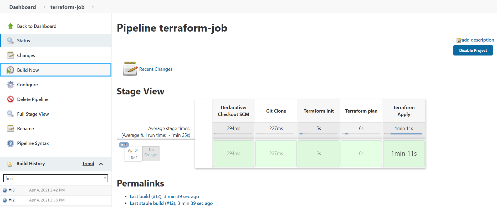

# Simple Jenkins-Terraform Integration

This project demonstrates a GitHub - Jenkins - Terraform workflow.




## Requirements
1. CloudBees Aws Credential Plugin
2. Credential Binding Plugin

Terraform requires access to AWS in order to execute its fuctions (create or destroy). This can be done using any of the following methods  

1. Attach an IAM role with the required permissions to the jenkins server.
step1. create the role and attach the needed policy 
step2 . Attach this role to the ec2 instance running jenkins

2. Input the IAM user's access and secret key in the terraform file - (Not secure)

3. The keys can be wrapped arround the terraform commands in jenkins using Credentials :- This was done here using the CloudBees Aws Credential Plugin and withCredential. An example is shoen below.


```
withCredentials([[$class: 'AmazonWebServicesCredentialsBinding', accessKeyVariable: 'AWS_ACCESS_KEY_ID', credentialsId: 'credential_id', secretKeyVariable: 'AWS_SECRET_ACCESS_KEY']]) {
                    sh 'terraform apply --auto-approve'

                }
```


## Terraform File

The terraform file executes the set up below:

1. Creates a VPC (Virtual Private Network)
2. Creates an Internet Gateway
3. Creates a Custom Route Table
4. Creates a Subnet
5. Associates the Subnet with the Route Table
6. Creates a Security Group to allow port 22, 80, 44
7. Creates a Network Interface with an IP in the subnet that was created in step 4
8. Assigns an Elastic IP to the network interface created in step 7
9. Create an Ubuntu Server and install apache2 (then enable the apache2 service)

## Completion



